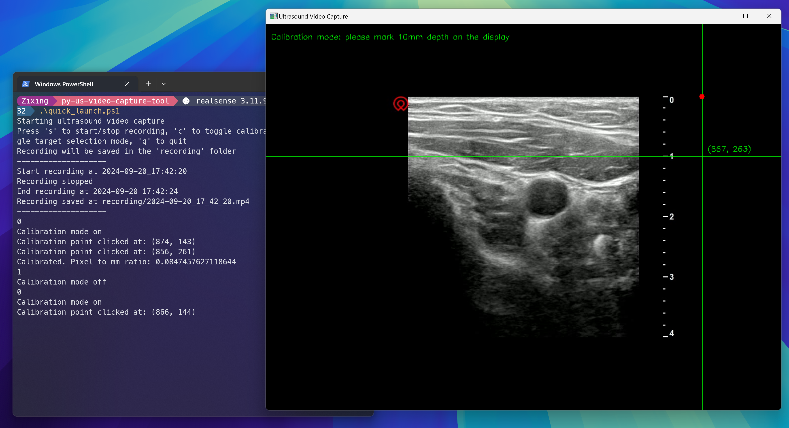
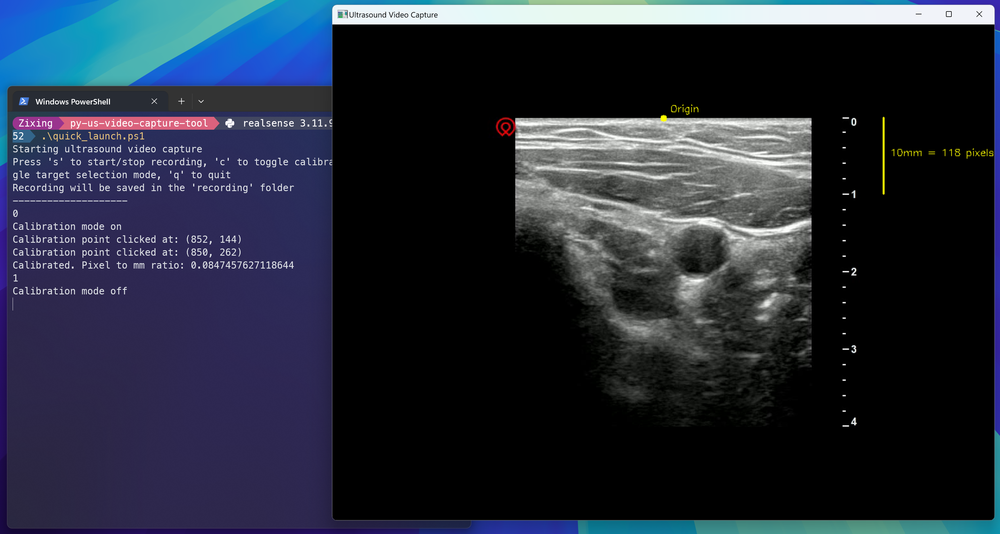
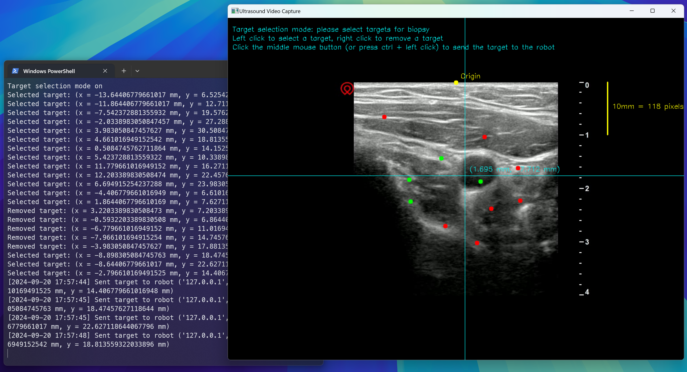

# A simple python script to capture live ultrasound video 

This package contains a simple python script to capture live ultrasound video from clinical ultrasound machines using a [video capture card](https://www.amazon.com/UGREEN-Recording-Streaming-Teaching-Conference/dp/B0BGMYPBF4/ref=asc_df_B0BGMYPBF4/?tag=hkgoshpadde-20&linkCode=df0&hvadid=680049709844&hvpos=&hvnetw=g&hvrand=2027351292518295012&hvpone=&hvptwo=&hvqmt=&hvdev=c&hvdvcmdl=&hvlocint=&hvlocphy=9191495&hvtargid=pla-1943464770846&psc=1&language=en_US&mcid=6c4da96552333c2cb6d45d0a261ab674). 

**Compatibility**: This package is tested with [Wisonic Clover](https://www.wisonic.com/en/list_26/189.html) and [bk5000](https://www.bkmedical.com/systems/bk5000/). Theoretically, it can be used with any ultrasound machine or other device with video export function.

**Features**: This package provides the following features:
- Capture live ultrasound video
- Ultrasound video recording and replay
- Manual calibration of the pixel-to-millimeter ratio based on image scales  
- Select targets and send them to the robot via UDP for further processing

## Getting started 
1. Install [Python3](https://www.python.org/downloads/). Recommended version: >= 3.11. 
2. Clone this repository to your workspace
```
cd /path/to/your/workspace
git clone https://github.com/zixingjiang/py-us-video-capture-tool.git
```
3. Install required packages:
```
pip install -r requirements.txt
```
5. Run the script:
```
python capture.py
```
## Command line arguments
All command line arguments are shown below
```
python capture.py -h
usage: capture.py [-h] [--capture_live_video | --no-capture_live_video] [--video_device VIDEO_DEVICE] [--video_file_path VIDEO_FILE_PATH] [--video_save_dir VIDEO_SAVE_DIR] [--video_save_fps VIDEO_SAVE_FPS]
                  [--video_width VIDEO_WIDTH] [--video_height VIDEO_HEIGHT] [--video_origin_x VIDEO_ORIGIN_X] [--video_origin_y VIDEO_ORIGIN_Y] [--self_ip SELF_IP] [--self_port SELF_PORT]
                  [--robot_ip ROBOT_IP] [--robot_port ROBOT_PORT]

A simple python script for ultrasound video capture

options:
  -h, --help            show this help message and exit
  --capture_live_video, --no-capture_live_video
                        Capture live video from the capture device. Otherwise, replay video from the video file
  --video_device VIDEO_DEVICE
                        Capture device index
  --video_file_path VIDEO_FILE_PATH
                        Path to the video file that will be replayed
  --video_save_dir VIDEO_SAVE_DIR
                        Directory to save the recording
  --video_save_fps VIDEO_SAVE_FPS
                        Frame per second of the saved video
  --video_width VIDEO_WIDTH
                        Width of the video in pixel
  --video_height VIDEO_HEIGHT
                        Height of the video in pixel
  --video_origin_x VIDEO_ORIGIN_X
                        X coordinate of the video origin in pixel
  --video_origin_y VIDEO_ORIGIN_Y
                        Y coordinate of the video origin in pixel
  --self_ip SELF_IP     Own IP address used to send UDP packets
  --self_port SELF_PORT
                        Own port number used to send UDP packets
  --robot_ip ROBOT_IP   Robot IP address to receive UDP packets
  --robot_port ROBOT_PORT
                        Robot port number to receive UDP packets
```

You should pay special attention to the following arguments:
### Video source
- Set ```--capture_live_video``` to capture live video from the capture device. Otherwise, the script will replay video from the video file specified by ```--video_file_path```.
- Specify the capture device index by ```--video_device```. Usually ```0``` refers to the laptop's built-in camera. You may try ```1```, ```2```, etc. to use the video capture card.

### Frame origin
If you need to use the calibration and target selection functions, you need to specify the origin of the ultrasonic video frame. The origin may be different for different ultrasound devices. It is recommended that you capture a video first, then measure the pixel coordinates of the origin in the video and pass them to this script via ```--video_origin_x``` and ```--video_origin_y``` arguments.

### UDP communication
If you need to use UDP communication with the robot for target selection, you need to set the IP and port of the local machine (the device running the script) and the robot.
- ```--self_ip``` and ```--self_port``` specify the IP address and port number of the local machine.
- ```--robot_ip``` and ```--robot_port``` specify the IP address and port number of the robot.

## Quick launch
To avoid typing a long command line every time, you can create a shell script to launch the script with your preferred arguments. See ```quick_launch.ps1``` for Windows Powershell and ```quick_launch.sh``` for Bash.

## User manual
If the script is successfully launched, you will see a window displaying the video and a log in the terminal.


### Video recording
Keeping the video window in focus, press the keyboard ```s``` key to start/stop video recording. By default, the recorded video is saved in the ```recording``` folder, and the video file name is the time you started recording. The following log in the terminal indicates successful recording:
```
Start recording at 2024-09-20_17:42:20
Recording stopped
End recording at 2024-09-20_17:42:24
Recording saved at recording/2024-09-20_17_42_20.mp4
```

### Calibration mode
Keeping the video window in focus, press the keyboard ```c``` key to enter/exit calibration mode. In this mode, your mouse will turn into a green crosshair. 



Click on the video window and select two points with a known vertical distance of 10 mm. The script will calculate the pixel distance between these two points and then calculate the pixel-to-millimeter ratio.



After calibration, there will be yellow dots and line segments marking the ultrasound frame origin and the pixel-to-millimeter ratio.

You can recalibrate by exiting and re-entering the calibration mode.

### Target selection mode
**Attention! Target selection mode can only be toggled after you done calibration.**

Keeping the video window in focus, press the keyboard ```t``` key to enter/exit target selection mode. In this mode, your mouse will turn into a cyan crosshair.



You can select or deselect targets by left/right clicking on the video window. The selected targets will be marked with red dots.
You can send selected targets to the robot via UDP by middle mouse click or ctrl+left click. Sent targets are marked with green dots. Targets are described by millimeter coordinates, which are calculated based on the manually calibrated pixel-to-millimeter ratio. 

You can clear all marker points in the current window by exiting and re-entering the target selection mode.

## UDP communication test
You can test the UDP communication using the provided ```udp_recv_test.py``` script. This script receives targets sent over UDP and print them on the terminal.

If the UDP communication is correctly set up, you will see the following logs in the terminal:

**The sender**
```
[2024-09-20 18:11:30] Sent target to robot ('127.0.0.1', 60522): (x = -13.64406779661017 mm, y = 6.525423728813559 mm)
[2024-09-20 18:11:31] Sent target to robot ('127.0.0.1', 60522): (x = 5.423728813559322 mm, y = 10.338983050847457 mm)
[2024-09-20 18:11:31] Sent target to robot ('127.0.0.1', 60522): (x = 6.694915254237288 mm, y = 23.983050847457626 mm)
[2024-09-20 18:11:31] Sent target to robot ('127.0.0.1', 60522): (x = -2.0338983050847457 mm, y = 27.28813559322034 mm)
[2024-09-20 18:11:32] Sent target to robot ('127.0.0.1', 60522): (x = 3.983050847457627 mm, y = 30.508474576271183 mm)
[2024-09-20 18:11:32] Sent target to robot ('127.0.0.1', 60522): (x = 12.203389830508474 mm, y = 22.457627118644066 mm)
[2024-09-20 18:11:33] Sent target to robot ('127.0.0.1', 60522): (x = 11.779661016949152 mm, y = 16.271186440677965 mm)
```

**The receiver**
```
python udp_recv_test.py
Server listening on ('127.0.0.1', 60522)...
Received target from ('127.0.0.1', 60511): (x = -13.64406779661017 mm, y = 6.525423728813559 mm)
Received target from ('127.0.0.1', 60511): (x = 5.423728813559322 mm, y = 10.338983050847457 mm)
Received target from ('127.0.0.1', 60511): (x = 6.694915254237288 mm, y = 23.983050847457626 mm)
Received target from ('127.0.0.1', 60511): (x = -2.0338983050847457 mm, y = 27.28813559322034 mm)
Received target from ('127.0.0.1', 60511): (x = 3.983050847457627 mm, y = 30.508474576271183 mm)
Received target from ('127.0.0.1', 60511): (x = 12.203389830508474 mm, y = 22.457627118644066 mm)
Received target from ('127.0.0.1', 60511): (x = 11.779661016949152 mm, y = 16.271186440677965 mm)
```